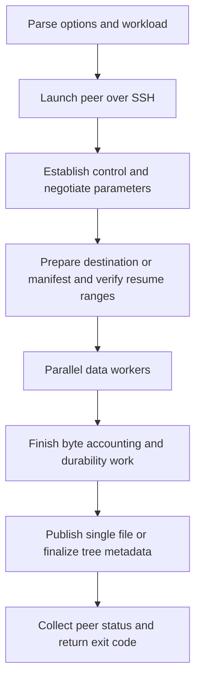

# Transfer architecture

MSC starts a peer through SSH, coordinates the transfer, and waits for child
status so receiver failures can reach the invoking shell. Reliable UDP is the
default for files and directory trees. `-T` selects TCP; stdin or command output
shapes require TCP, and combining those shapes with explicit `-U` is rejected.

## Transfer lifecycle

The exact order of destination preparation and control records depends on the
mode. In the default UDP topology, SSH stdio remains the reliable control
stream. Receiver ports, version/features, path probes, and transfer parameters
are exchanged before file data. See [wire protocol](wire-protocol.md).

## TCP workers

For segmented files, sender workers independently claim offset-labeled regions
from shared scheduling state, read them, and send them on parallel TCP streams.
Receiver workers write to the supplied offsets. This allows each worker to
progress without a single application thread serializing all file/socket work.
The kernel provides each stream's packet reliability and congestion control.

The stdin/remote-command path uses streaming behavior suited to pipes. It does
not have the same random-access and checkpoint guarantees as a regular file.

## UDP partitioning

The portable UDP partition gives each logical flow a contiguous range of global
transfer units. When usable Lustre geometry is available, an affine partition
can assign stripes to flows. Units are cut at stripe boundaries; the final unit
of a stripe may be shorter than the selected payload. Both peers must derive
the same mapping.

A flow has its own sender/receiver state and congestion estimates. Physical
sockets are a separate choice: K sockets carry N flows, with a demultiplexer
when a socket is shared. See [sockets and control](sockets-and-control.md).

## Recursive transfers

The manifest describes directories, regular files, empty files, symlinks, hard
links, and supported metadata. UDP indexes nonempty regular files into one
logical transfer table and keeps the session available across transfer calls.
The receiver derives the file from a unit's position in that table; individual
DATA packets do not carry path strings.

The table path opens its files up front and raises the soft descriptor limit
when necessary, up to the process hard limit. Large trees can therefore require
many descriptors. Resume ranges use a concatenated byte space, while transport
units also account for per-file and stripe tails. These are different indices.

## Multiple machine pairs and Lustre

Matching source/destination machine lists divide a file among child transfers.
They rely on the participating hosts seeing the appropriate shared files.
This is not automatic discovery or replication among arbitrary independent
local filesystems. Recursive and checkpointed CLI transfers require one pair.

Source stripe geometry controls transport mapping. `--dest-stripe-count` controls
destination creation independently; it does not change the sender's partition.
See [performance](performance.md) for the write-path and layout tradeoffs.

## Source map

| File | Responsibility |
| --- | --- |
| [msc.c](../msc.c), [parse.c](../parse.c), [man.c](../man.c) | Entry point, CLI, defaults, embedded manual. |
| [local_single.c](../local_single.c), [local_multiple.c](../local_multiple.c), [fork.c](../fork.c) | SSH orchestration, worker pairs, child status, retries. |
| [local_sockets.c](../local_sockets.c), [remote.c](../remote.c) | TCP send/receive workers and receiver launch. |
| [udp_transport.c](../udp_transport.c) | UDP bridge for CLI, manifests, checkpoints, and errors. |
| [udp_session.c](../udp_session.c), [udp_session.h](../udp_session.h) | Data protocol, flow state machines, congestion, pacing, PMTUD, offloads. |
| [udp_control.c](../udp_control.c), [port_spec.c](../port_spec.c) | Control carriers, demultiplexing, port specification. |
| [udp_io.c](../udp_io.c) | Private I/O/checksum helpers and optional Lustre integration. |
| [recursive.c](../recursive.c), [resume.c](../resume.c) | Manifests, tree transfer, checkpoints, reused-range verification. |
| [udp_stats.c](../udp_stats.c), [progress.c](../progress.c) | Transport telemetry and user progress. |
| [cancellation.c](../cancellation.c), [netutil.c](../netutil.c) | Signal state and bounded network I/O helpers. |

## Implementation and validation

Use the source map above to locate ownership boundaries. [Testing](testing.md)
distinguishes direct harnesses, CLI tests, simulated WAN conditions, and real
Lustre checks. A direct harness bypasses CLI parsing, so it cannot verify the
defaults selected by a user's command line.
