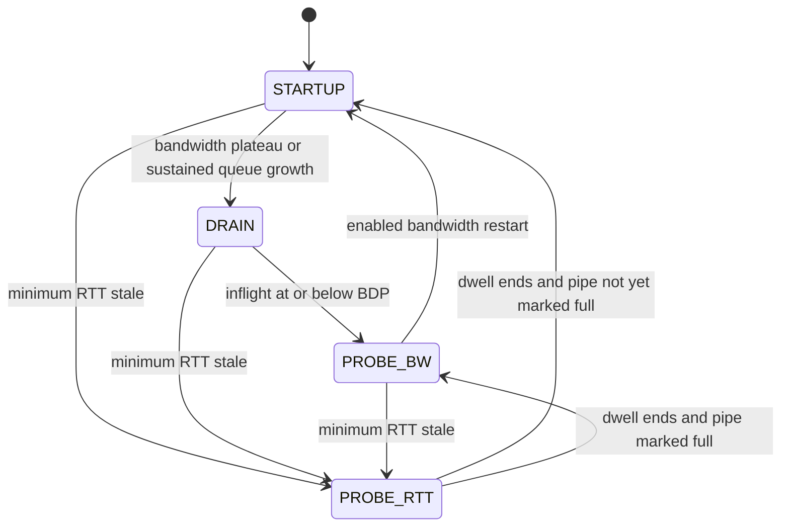

# Congestion control and pacing

MSC's UDP controllers run in userspace, one instance per logical flow. Select
one with `MSC_UDP_CC=rate|reno|cubic`; `rate` is the default. These settings do
not select the kernel controller for a `-T` TCP transfer.

To build your own algorithm, start with the hands-on
[controller implementation and testing guide](adding-a-controller.md). It includes
a working ops-table example and a local clean/loss test helper.

All three share the [reliability state machine](reliability.md). A lost packet
must be repaired regardless of which controller sets the window.

## Three limits on fresh sending

The congestion window (`cwnd`) limits outstanding units based on transport
feedback. The receiver window (`rwnd`) limits them based on receiver capacity.
The pacing bucket limits when fresh units may be released. The sender ring
imposes an additional hard maximum of 16,383 outstanding units.

The default `rate` controller always enables pacing, including on LAN paths.
`MSC_UDP_PACE=0` with `rate` produces a warning and is ignored. With Reno or
CUBIC, LAN defaults leave pacing off; WAN presets enable it unless explicitly
overridden. A positive aggregate rate cap also enables pacing.

| Behavior | `reno` | `cubic` | `rate` (default) |
| --- | --- | --- | --- |
| Growth | Slow start, then additive increase | Slow start, then cubic target with a TCP-friendly estimate | Delivery-rate/minimum-RTT model with startup and probing |
| Fast loss | Multiply window by 0.5 by default | Multiply window by 0.7 by default | No immediate callback reduction; round loss can engage an inflight cap |
| ECN callback | Same reduction path as fast loss | Same reduction path as fast loss | No-op |
| RTO | Reset window to 1 by default | Reset window to 1 by default | Reset window to 4; retain bandwidth/RTT estimates |
| Pacing rate when enabled | Gain × `cwnd/SRTT` | Gain × `cwnd/SRTT` | State gain × estimated delivery rate |

Loss reductions are gated by a recovery boundary. `MSC_UDP_CC_BETA`,
`MSC_UDP_MIN_CWND`, and `MSC_UDP_RTO_GENTLE` modify the loss-based controllers.
They do not redefine the rate controller's independent window policy.

## Reno and CUBIC

In slow start, each newly acknowledged unit increases `cwnd` by one. Reno's
avoidance phase adds approximately `1/cwnd` per acknowledged unit. A fast-loss
episode sets `ssthresh` and `cwnd` to `beta*cwnd`, with applicable floors.

CUBIC tracks the previous maximum, applies fast convergence when appropriate,
and grows toward

```text
W(t) = origin + C * (t - K)^3,    C = 0.4
```

Here `t` includes the elapsed epoch time and SRTT. Its TCP-friendly estimate
can raise the target. The default reduction factor is 0.7, unless explicitly
overridden.

On RTO, both halve `ssthresh` (with a minimum of two), independently of the
configured beta. Their new `cwnd` is one, or `beta*cwnd` when gentle RTO is
enabled, then floored by `MSC_UDP_MIN_CWND`. DSACK can undo an episode whose
retransmissions all prove spurious.

## Delivery-rate controller

`rate` is MSC's BBR-inspired implementation. It is not a claim of compatibility
with a particular kernel BBR version.

Each flow maintains a windowed maximum delivery rate, in units/second, and a
minimum RTT. Their product estimates the bandwidth-delay product (BDP), in
units. Delivery sampling uses send-side as well as ACK-side elapsed time to
limit inflation from compressed ACKs. Application-limited samples may raise
the bandwidth estimate but do not lower it.

| Parameter | Value |
| --- | ---: |
| Startup pacing/window gain | 2.885 |
| Steady window gain | 2.0 |
| Bandwidth filter window | 10 packet-timed rounds |
| Minimum-RTT staleness | 10 s |
| PROBE_RTT dwell after draining | 200 ms |
| PROBE_RTT and timeout window | 4 units |



STARTUP ends after three eligible rounds without at least 25% growth in the
bandwidth estimate. Application-limited or retransmitting rounds do not count
toward that plateau. Profiles with a delay exit also leave startup when SRTT
exceeds their minimum-RTT multiple for two rounds. A sibling flow finishing
resets the plateau accounting.

DRAIN uses a pacing gain of `1/2.885`. PROBE_BW cycles through gains
`1.25, 0.75, 1, 1, 1, 1, 1, 1`, advancing by elapsed minimum-RTT intervals.
These phase transitions are distinct from the packet-timed rounds used by the
bandwidth filter and loss accounting. Enabled restart logic can re-enter
STARTUP when a sibling finishes or the flow repeatedly detects an underfilled
path without congested rounds.

PROBE_RTT drains to four units, dwells, refreshes the minimum RTT, and restores
the saved window on exit when it is larger. An RTO also resets to four while
retaining the estimators, allowing subsequent ACKs to reopen the window.

### Window calculation and floors

The conceptual target is `gain * bandwidth * min_rtt`. The actual ACK update
adds acknowledged units, bounds against the target with a two-feedback-interval
ACK-quantum floor, applies any inflight cap, then enforces a **16-unit normal
window floor** and the ring maximum. The 16-unit floor is the compiled
`MSC_UDP_INIT_CWND`, not the profile's initial window. PROBE_RTT returns early
with its four-unit limit; an RTO can temporarily set four until later updates.

These details matter on low-BDP paths. A description consisting only of
`cwnd = 2 * BDP` would omit behavior present in the implementation.

### Loss-bounded inflight cap

At a packet-timed round boundary, define:

```text
I = snd_nxt - snd_una
r = retransmissions issued during the round
s = DSACK-proven spurious retransmissions recorded during the round
d = units delivered during the round
losses = max(0, r - s)
congested = losses > floor(d / 50) + 2
```

Let `H=0` mean no cap and `q` count consecutive congested rounds.

| Round result | Update |
| --- | --- |
| Congested | Increment `q`. At `q >= 2`, compute `candidate=max(4,0.85*I)`; set `H=candidate` if uncapped, otherwise `H=min(H,candidate)`. |
| Sub-threshold, capped | Reset `q`; grow `H` by 1.25. Clear it when it exceeds 16,383. |
| Sub-threshold, uncapped | Reset `q`. |

DSACK evidence can arrive a round later than the retransmission it explains,
so this is approximate round accounting. The threshold is a controller
heuristic, not proof that the loss originated at a congested network queue.
The cap is applied during subsequent window updates, subject to the normal
16-unit floor described above.

### ECN and multiple flows

ECN marking and CE feedback are enabled by default, but the `rate` controller's
ECN callback is currently a no-op. Reno and CUBIC use the loss reduction path.
The `ecncut` statistic counts callback dispatches and can increase in rate mode
without any actual window reduction.

Flows do not share bandwidth or minimum-RTT estimates. `MSC_UDP_FAIR=1` enables
an aggregate token bucket to coordinate fresh sends. It is off by default.
`MSC_UDP_PACE_RATE_MBIT` supplies an explicit aggregate fresh-payload cap.
Neither setting is a wire-rate bound on retransmissions, ACKs, control traffic,
or headers, and the coordination bucket is not evidence of fairness against
other applications.

The original evaluation did not establish fairness against competing traffic
at a shared bottleneck. Keep that limitation in mind when comparing the rate
controller with the loss-based alternatives; do not generalize isolated
throughput measurements into a coexistence guarantee.

## Adding a controller

Add an enum value and parser name, implement a `msc_udp_cc_ops` table, and
register it in `cc_ops_for`. Put per-flow state in `sender_flow`, with ownership
in `init`/`destroy`. Callbacks receive sends, delivery counts, RTT samples,
cumulative ACKs, SACK feedback, loss, ECN, and RTO events. Keep shared packet
parsing, retransmission selection, and receiver-window enforcement in the
transport. Add useful state to `flow_sample` telemetry.

## Implementation and validation

- [udp_session.c](../udp_session.c): `msc_udp_cc_ops`, `loss_cc_on_ack`,
  `loss_cc_on_loss`, `loss_cc_on_rto`, `rate_sample`, `rate_update`,
  `rate_on_ack_cwnd`, `pace_grant`, and `fair_reserve`.
- [udp_session.h](../udp_session.h): controller constants.
- [udp_parity_test.sh](../udp_parity_test.sh): rate/CUBIC transfer checks.
- [env_preset_test.sh](../env_preset_test.sh) and [wanshim_test.sh](../wanshim_test.sh):
  preset and impaired-path checks. These are not comprehensive algorithm or
  cross-traffic fairness tests.
