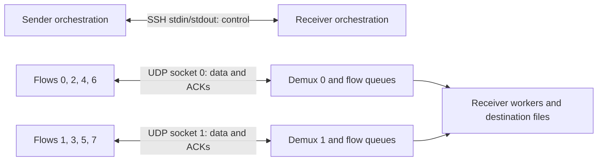

# Sockets, ports, and control channels

**SSH stdio is the default UDP control channel.** MSC launches its peer over
SSH and carries control records over that session's stdin/stdout. File contents
travel over separate UDP sockets. MSC adds no TCP listener in this mode; the
existing SSH service still requires its normal access, and the receiver must
accept inbound UDP data on the advertised ports.

## Logical flows and physical sockets

`-n N` creates N logical flows, each with its own sequence space, worker,
reliability state, congestion controller, and receiver window. K physical data
sockets can carry them, with `1 <= K <= N`:

```text
socket(f) = f mod K
queue_index(f) = floor(f / K)
```

With eight flows and two sockets, socket 0 carries flows 0, 2, 4, 6 and socket 1
carries 1, 3, 5, 7. Each socket is bidirectional: DATA and FIN go toward the
receiver, and ACK/SACK/window/ECN feedback returns on the same path.



## Control topologies

`MSC_UDP_CTL` selects the topology. It must agree at both ends before session
negotiation can begin; MSC forwards it through the SSH launch.

| Mode | Control carrier | Data sockets | Additional receiver ports beyond SSH |
| --- | --- | --- | --- |
| `stdio` (default) | SSH stdin/stdout | K, default `min(N,8)` | K UDP data ports |
| `stdio1` | SSH stdin/stdout | One | One UDP data port |
| `tcp` | Separate TCP connection | K, default `min(N,8)` | One TCP control port plus K UDP data ports |
| `many` | Reliable UDP control shim | K, default `min(N,8)` | One UDP control port plus K UDP data ports |
| `one` | Reliable UDP control shim sharing data socket | One shared socket | One UDP control/data port |

`MSC_UDP_CTL=tcp` still sends file data over UDP. `-T` selects TCP file transfer,
which is a separate transport. Explicit non-`tcp` values of `MSC_UDP_CTL` are
rejected on TCP transfers, including automatic stdin/command fallback.

Stdio modes require the launcher's connected pipes. After the `MSC-CONNECT`
rendezvous line, receiver stdout carries binary control records; diagnostic
output must use stderr. The receiver preserves the control write descriptor
before redirecting ordinary stdout to stderr. Statistics requested on stdout
are redirected to stderr in stdio modes.

## Selecting ports

Under default `stdio`, the receiver scans for K free data ports beginning at
17400. The default window is `4*K` ports, capped by the 1,024-port scan limit.
Each successful bind reserves a port exclusively: data sockets use neither
`SO_REUSEADDR` nor `SO_REUSEPORT`. Concurrent transfers can obtain disjoint
port sets from the same window.

| Request | Behavior |
| --- | --- |
| `--udp-data-ports K` | Set socket count, clamped to the number of flows. |
| `--udp-port-base B` | Start scanning at B. This alone does not request an exact block. |
| `--udp-port-span S`, S > 0 | Search `[B,B+S)` for K available ports. |
| `--udp-port-span 0` | Require precisely `B..B+K-1`; fail if any port is busy. |
| `--udp-ports LIST` | Require the listed ports in order; K comes from the list. |

For example, `--udp-data-ports 4 --udp-port-base 20000 --udp-port-span 16`
permits four ports anywhere in 20000–20015. Replacing the span with zero
requires 20000–20003. An exact list cannot be combined with base/span flags;
an explicit count must agree with the list.

The CLI data-port flags apply to `stdio` and `tcp` control modes. They are
rejected with `stdio1`, `many`, or `one`. The engine also reads the
`MSC_UDP_PORTS`, `MSC_UDP_PORT_BASE`, `MSC_UDP_PORT_SPAN`, and
`MSC_UDP_PORT_LIST` environment settings; single-socket modes force the count
to one. In `one`, the actual socket is the UDP control socket selected from
`-p`/`--port-tries`, not a separate data-port allocation. Prefer default `stdio`
with `--udp-data-ports 1` when specifying an exact single data port.

Socket-based control rendezvous starts at `-p` (16400 by default), trying up to
`--port-tries` ports (100 by default). Stdio needs no such listener. Exact data
port flags are rejected for multiple machine pairs, whose child transfers need
independent allocations.

The receiver advertises its ordered data-port list. The sender verifies the
count and permitted range or exact list before sending file data, then opens
connected UDP sockets with normally ephemeral source ports. Permit return ACKs
as well as sender-to-receiver traffic. This mechanism does not implement NAT
hole punching or a relay.

## Demultiplexing and ownership

A flow with exclusive use of a socket receives directly. If several flows
share a socket, a single demultiplexer thread owns reads from it and routes
packets into bounded per-flow queues. This prevents one worker from consuming
another flow's ACK or DATA packet.

Routing validates the flow-to-socket mapping. GRO buffers are split into
individual datagrams before classification. Source addresses and IP TOS/ECN
metadata accompany the queued packet. A full queue drops an arriving packet
and increments a counter; it does not block all other flows sharing the socket.
Reliability repairs dropped data, and later cumulative ACKs supersede lost
feedback.

Buffer management has one owner per shared descriptor. Buffer targets account
for the number of flows on that socket. Kernel socket drops and userspace queue
drops are distinct counters.

When control and data share a descriptor, the control FIN exchange finishes
while the demultiplexer is still available. Shutdown then stops and joins the
demultiplexer and closes the physical socket once. Flow aliases must not close
a descriptor still owned by the session.

## The optional reliable UDP control shim

The shim offers an ordered byte stream with go-back-N, cumulative byte ACKs,
and an advertised byte window. It has no SACK or adaptive RTT estimator. Its
initial retransmission timeout is 100 ms, backing off to 2 s; retry and connect
budgets bound a silent peer. The stream window is 64 KiB per direction and the
maximum control payload is 1,376 bytes.

A SYN handshake checks the shim version and control mode. A separate signature
distinguishes control frames from data frames in `one` mode. See
[wire protocol](wire-protocol.md) for framing. SSH stdio uses the reliable SSH
byte stream directly and does not wrap its records in this UDP shim.

## Implementation and validation

- [udp_control.c](../udp_control.c): `msc_udp_ctl_mode`, control shim, queues,
  and demultiplexer.
- [udp_session.c](../udp_session.c): `resolve_nports`, `sender_check_ports`,
  `sockset_build`, and socket ownership.
- [port_spec.c](../port_spec.c): exact/scan parsing and resolution.
- [remote.c](../remote.c) and [local_single.c](../local_single.c): SSH rendezvous.
- [stdio_ctl_test.sh](../stdio_ctl_test.sh): byte checks and TCP-listener
  instrumentation; [udp_parity_test.sh](../udp_parity_test.sh): port selection;
  [udp_recursive_ctl_test.sh](../udp_recursive_ctl_test.sh): control-mode coverage.
